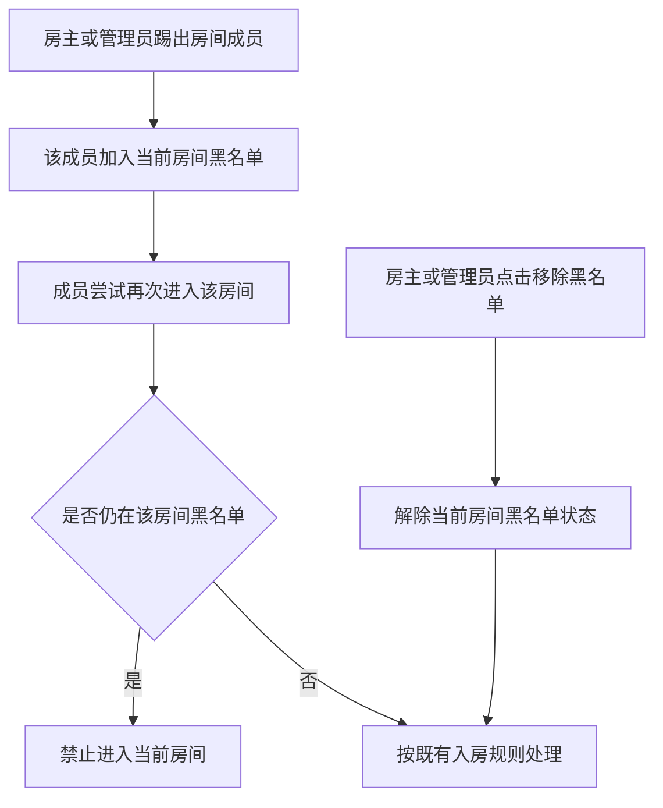
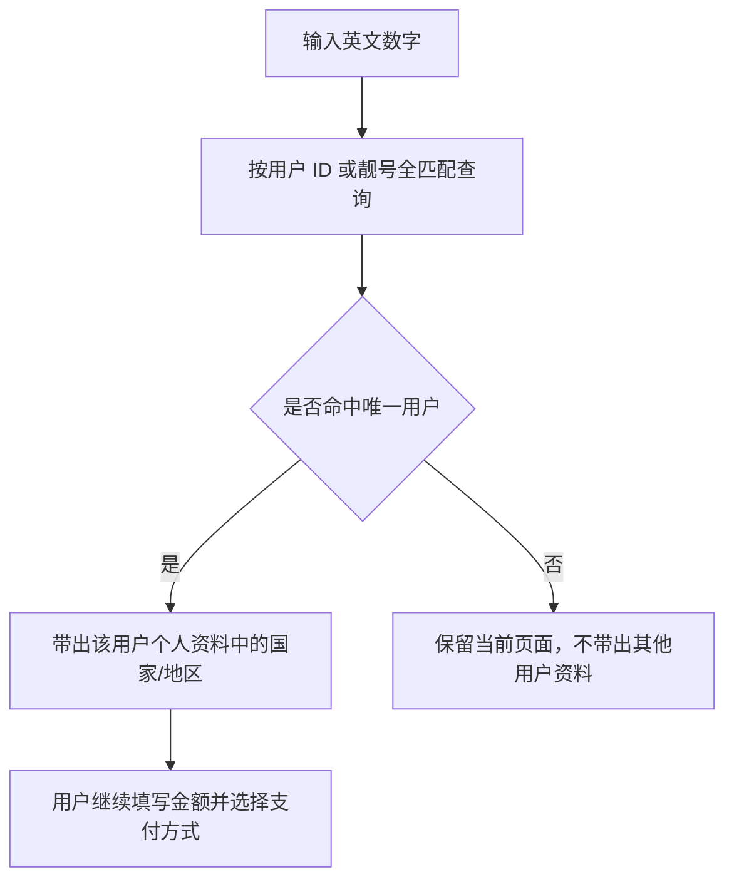
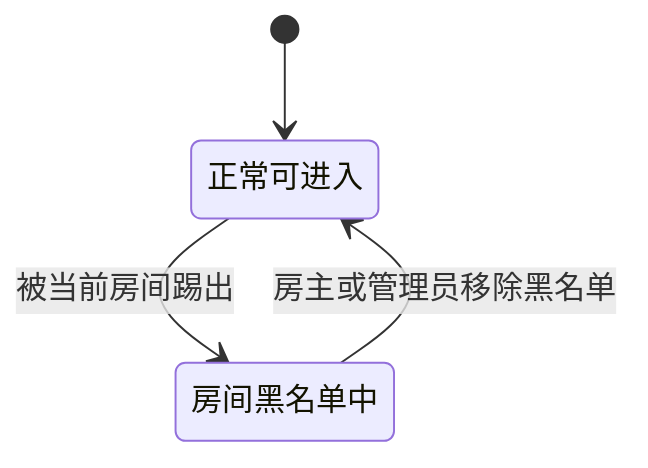
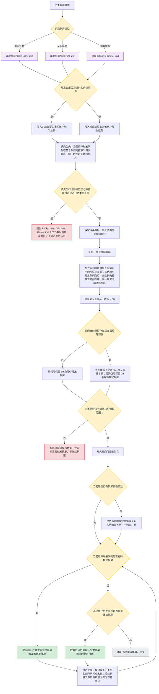
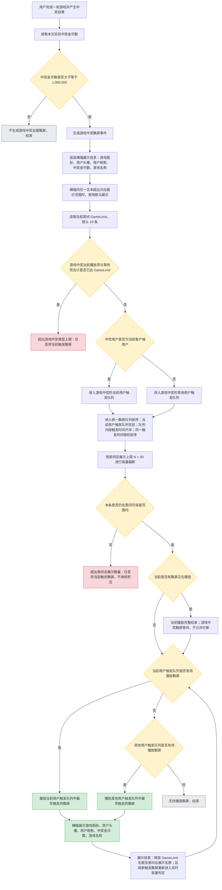

# TOPKHALIJ 2.1.30 需求文档（由 2.1.21 拆分）

| 项目 | 内容 |
|---|---|
| 产品 | TOPKHALIJ |
| 版本 | 2.1.30 |
| 文档状态 | 按版本拆分后的正式范围 |
| 拆分依据 | 从原 2.1.21 范围迁入：身份标签、首页调整、靓号搜索、房间黑名单、全服礼物飘屏、第三方充值 H5，以及关联后台配置 |
| 脑图来源 | `TOPKHALIJ_2.1.30.xmind`（拆分版） |
| 原型来源 | `2.1.30原型图/` 下 9 张 JPG |

## 一、版本目标与范围

本版本承接用户身份、用户检索、房间管理、全服礼物飘屏、首页调整、第三方充值 H5 和关联后台配置。

| 端 | 本次模块 |
|---|---|
| 客户端 | 身份标签、首页调整、靓号搜索、房间黑名单、全服礼物飘屏（含游戏中奖飘屏优先级） |
| H5 | 第三方充值链接兼容靓号搜索及国家地区自动带出 |
| 后台 | 礼物全服广播配置、用户身份展示与多选编辑 |

### 1.1 源材料采用原则

1. 脑图用于确认业务规则与范围；原型用于确认页面结构、字段位置和展示形态。
2. 原型未展示、脑图也未描述的字段、限制、数值和流程不补造；本文仅记录已确认的业务范围与规则。
3. 例图中的用户名、ID、礼物名、金额、日期和房间号均为展示样例，不作为业务配置值。

---

## 二、全局规则

### 2.1 用户身份展示规则

| 规则 | 说明 |
|---|---|
| 展示位置 | 个人中心、个人资料全屏页、个人资料半屏卡均展示用户身份标签。 |
| 身份范围 | 客户端身份标签仅展示用户**当前有效身份**：公会长、主播、币商、BD、official、BDM、ACM、Manager、Super Admin、Customer Service / Admin。 |
| 公会长覆盖主播 | 用户同时具备公会长与主播身份时，仅展示“公会长”，不展示“主播”；仅具主播身份时展示“主播”。 |
| 多身份展示 | 除“公会长覆盖主播”外，同一用户的多项当前有效身份均作为独立标签展示；原型中的“公会长、币商、超管、官方”仅为示例，不能缩减实际身份范围。 |
| 非身份标签隔离 | VIP、财富等级、魅力等级及其他权益/等级信息不属于用户身份标签，不得混入本模块。 |
| 数据一致性 | 客户端三个资料展示面与后台用户列表读取同一份当前身份结果；身份失效或被撤销后，不再作为当前身份展示。 |

> 后台“用户身份”字段支持多选；用户可同时保留多项可编辑的当前有效身份，并同步用于客户端身份标签展示。身份变更保存成功后，客户端身份标签立即刷新为最新身份结果。

### 2.2 用户 ID 与靓号检索规则

| 规则 | 说明 |
|---|---|
| 可输入内容 | 支持输入英文数字。 |
| 匹配字段 | 用户 ID 或靓号。 |
| 匹配方式 | 全匹配查找，不使用模糊匹配。 |
| 使用场景 | 币商售币、房间在线用户列表、邀请上麦列表、第三方充值 H5。 |
| 结果口径 | 命中后展示/绑定实际用户资料，后续交易、邀请或国家地区带出均以该实际用户为准。 |

---

# 三、客户端需求

---

---

## 3.1 个人中心与个人资料页身份标签

#### 对应原型

### 3.1.1 页面覆盖范围

| 页面 | 标签位置 |
|---|---|
| 个人中心 | 位于头像、昵称、ID 和等级信息下方，关注/粉丝/访客数据上方。 |
| 个人资料页全屏 | 位于用户资料、等级/权益信息下方，“个人信息/动态”页签上方。 |
| 个人资料页半屏 | 位于半屏资料卡中部、礼物墙上方；底层房间页面继续可见。 |

### 3.1.2 身份标签展示内容

客户端在 §3.1.1 的三个页面中，按用户当前有效身份展示以下标签。标签仅用于展示用户身份，不代表新增按钮、跳转或可操作权限。

| 当前有效身份 | 客户端展示标签 | 展示规则 |
|---|---|---|
| 公会长 | 公会长 | 用户同时具备公会长与主播身份时，只展示“公会长”，不展示“主播”。 |
| 主播 | 主播 | 仅在用户不具备公会长身份且当前具备主播身份时展示。 |
| 币商 | 币商 | 当前具备币商身份时展示。 |
| BD | BD | 当前具备 BD 身份时展示。 |
| official | official | 当前具备 official 身份时展示；不因原型示例使用“官方”而替换脑图已确认的身份值。 |
| BDM | BDM | 当前具备 BDM 身份时展示。 |
| ACM | ACM | 当前具备 ACM 身份时展示。 |
| Manager | Manager | 当前具备 Manager 身份时展示。 |
| Super Admin | Super Admin | 当前具备 Super Admin 身份时展示。 |
| Customer Service / Admin | Customer Service / Admin | 当前具备 Customer Service / Admin 身份时展示。 |

### 3.1.3 当前身份判断与多身份规则

- 展示对象为用户的**当前有效身份**；身份撤销、失效或不再属于当前身份范围后，不再展示对应标签。
- 除“公会长覆盖主播”外，用户同时具备的其他当前有效身份均需展示，不得因原型只展示部分示例标签而漏展示。
- 客户端身份标签与后台用户列表的“用户身份”字段使用相同身份结果；个人中心、个人资料全屏页、个人资料半屏卡的身份集合必须一致。
- 用户身份变更保存成功后，客户端三个资料展示面立即刷新身份标签；身份失效或撤销后，不得继续展示对应标签。
- VIP、财富等级、魅力等级和其他权益/等级信息继续按原页面分区展示，不能作为身份标签，也不能替代身份标签。

### 3.1.4 交互与边界

- 本次仅新增身份标签展示，不改变个人资料页、礼物墙、关注、粉丝、访客等既有功能。
- 用户身份变更保存成功后，客户端立即刷新身份标签；不再保留旧身份展示。
- 历史截图、历史消息不追溯改写。

---

---

## 3.2 首页调整

#### 对应原型

### 3.2.1 热门房间

| 调整项 | 规则 |
|---|---|
| 热度值 | 隐藏热门房间卡片中的热度值。 |
| 其他内容 | 房间封面、房间名称、TOP 标识及既有房间入口保持原页面逻辑；本次不新增原型未展示的排序口径。 |

### 3.2.2 大咖

| 字段/规则 | 说明 |
|---|---|
| 数据范围 | 展示财富榜前 10 位用户，实际返回数量以系统返回为准。 |
| 展示形态 | 以横向头像列表展示用户。 |
| 溢出处理 | 超出当前可见范围时进行轮播展示。 |
| 无数据处理 | 原型未定义空态文案与占位图，待确认。 |

### 3.2.3 榜单入口

| 字段/规则 | 说明 |
|---|---|
| 展示内容 | 页面底部榜单入口展示本周财富榜第一名用户头像。 |
| 无数据 | 无本周财富榜第一名数据时，展示当前入口图标。 |
| 入口行为 | 本次仅调整入口视觉承载内容；点击后的既有跳转逻辑不在本次变更范围。 |

---

---

## 3.3 靓号搜索优化与自动佩戴

#### 对应原型

### 3.3.1 覆盖场景

| 场景 | 原型可见入口 | 调整内容 |
|---|---|---|
| 币商售币 | “输入用户ID”输入区，下方展示主播名称与 ID 结果区 | 输入用户 ID 或靓号，全匹配查找对应用户。 |
| 房间用户列表 | “请输入用户ID搜索”输入框与“搜索”按钮 | 输入用户 ID 或靓号，全匹配查找对应用户并展示用户结果。 |
| 排麦列表-邀请上麦列表 | “请输入用户ID搜索”输入框与“搜索”按钮 | 输入用户 ID 或靓号，全匹配查找可邀请用户。 |

### 3.3.2 搜索交互

| 场景 | 成功结果 | 未命中结果 |
|---|---|---|
| 币商售币 | 在用户资料结果区展示命中用户的头像、主播名称和 ID，允许继续填写交易金币数。 | 清空或保持占位结果，不允许将未命中对象带入成交。 |
| 房间用户列表 | 在在线用户列表内展示命中用户资料卡。 | 按原型空态展示“暂无数据”。 |
| 邀请上麦列表 | 在邀请上麦列表内展示命中且可操作的用户。 | 按原型空态展示“暂无数据”。 |

### 3.3.3 自动佩戴靓号

| 触发条件 | 系统处理 |
|---|---|
| 用户获得靓号，且当前未佩戴任何靓号 | 自动佩戴本次发放的靓号。 |
| 用户获得靓号，且当前已佩戴靓号 | 不自动替换当前已佩戴靓号。 |

### 3.3.4 边界

- 搜索仅支持全匹配，不将“输入片段”“相似昵称”作为命中结果。
- 用户 ID 与靓号在全局已去重，同一输入值仅能对应一个用户；售币、邀请、充值均可按命中的唯一用户继续处理。
- 自动佩戴仅在“获得靓号”事件触发时执行，不应因用户进入搜索页面、查看资料页等行为改变佩戴状态。

---

---

## 3.4 房间管理与房间黑名单

#### 对应原型

### 3.4.1 页面入口与权限

| 项目 | 说明 |
|---|---|
| 入口 | 房间管理页新增“房间黑名单”列表项；点击进入独立黑名单页面。 |
| 操作角色 | 房主或管理员可手动移出房间黑名单。 |
| 列表操作 | 每条黑名单用户记录提供“移除黑名单”按钮。 |

### 3.4.2 黑名单列表

| 字段/规则 | 说明 |
|---|---|
| 列表对象 | 显示已被该房间踢出、且尚未被移出房间黑名单的用户。 |
| 用户信息 | 显示用户头像、用户名和“移除黑名单”操作。 |
| 排序 | 按踢出时间降序排序，最近被踢出的用户排在最前。 |
| 空列表 | 原型未定义空态文案，待确认。 |

### 3.4.3 踢出与入房拦截

- 用户被踢出某个房间后，必须加入该房间黑名单。
- 已在房间黑名单中的用户再次被踢出时，更新该用户的踢出时间；黑名单列表按更新后的踢出时间降序排序。
- 在房主或管理员手动移除前，该用户永久无法进入该房间。
- 黑名单按房间维度生效，不延伸为全站黑名单。
- 解除黑名单后，仅解除该房间的入房限制；其他房间状态不受影响。

---

---

## 3.5 房间全服礼物飘屏

#### 对应原型

### 3.5.1 触发条件

后台为礼物配置“全服礼物飘屏”全服广播选项后，用户赠送该礼物时，在所有房间展示该礼物飘屏。

### 3.5.2 飘屏展示结构

| 区块 | 展示内容 | 超长处理 |
|---|---|---|
| 用户信息 | 收礼方、送礼方名称 | 横幅内文本超出对应展示范围时跑马展示；收礼方有多个时，使用英文逗号 `,` 分隔。 |
| 用户头像 | 送礼方头像 | 按原型位置展示。 |
| 礼物信息 | 礼物名称、礼物图标 | 礼物名称及横幅内其他文本超出对应展示范围时跑马展示。 |
| 文案结构 | “送礼方给收礼方赠送了礼物名称” | 使用当前用户和礼物数据替换原型占位文本；文案文本超出对应展示范围时跑马展示。 |

### 3.5.3 飘屏队列与播放顺序

本节规则同时适用于全服礼物飘屏、幸运礼物飘屏和游戏中奖全服飘屏；三类飘屏不再按飘屏类型设置固定优先级。

| 队列分层 | 进入条件 | 播放顺序 |
|---|---|---|
| 当前用户触发队列 | 当前客户端用户自己触发全服礼物飘屏、幸运礼物飘屏或游戏中奖全服飘屏。 | 优先于其他用户触发队列；同一队列存在多条飘屏时，按触发时间升序播放。 |
| 其他用户触发队列 | 非当前客户端用户触发的全服礼物飘屏、幸运礼物飘屏或游戏中奖全服飘屏。 | 在当前用户触发队列之后播放；同一队列存在多条飘屏时，按触发时间升序播放。 |

| 服务端房间级数量配置 | 适用飘屏 | 数量规则 |
|---|---|---|
| 房间总飘屏最大展示数量 `N` | 三类飘屏合计 | 本版本暂定 `N = 30` 条。 |
| 幸运礼物飘屏最大展示数量 `LuckyLimit` | 幸运礼物飘屏 | 服务端按房间配置，默认值为 10 条；当前正在播放与等待播放的幸运礼物飘屏合计不得超过该值。 |
| 全服礼物飘屏最大展示数量 `GiftLimit` | 全服礼物飘屏 | 服务端按房间配置，默认值为 10 条；当前正在播放与等待播放的全服礼物飘屏合计不得超过该值。 |
| 游戏中奖飘屏最大展示数量 `GameLimit` | 游戏中奖全服飘屏 | 服务端按房间配置，默认值为 10 条；当前正在播放与等待播放的游戏中奖飘屏合计不得超过该值。 |

- 当前用户自己触发的飘屏进入待展示队列最前面的“当前用户触发队列”；该队列中较早触发的飘屏先播放。
- 当前用户触发队列为空后，播放其他用户触发队列中触发时间最早的飘屏。
- 飘屏类型不参与同一队列内的排序；不得继续沿用按飘屏类型设置优先级的旧排序规则。
- 飘屏先按类型分别处理：在每个类型内，按“当前用户触发队列在前、其他用户触发队列在后；各队列内按触发时间升序”排序，仅保留该类型最大展示数量范围内的飘屏；超出该类型最大展示数量的飘屏直接不展示。
- 各类型保留的飘屏汇总后，再按本节统一队列规则排序，并受房间总飘屏最大展示数量 `N` 限制；类型最大展示数量仅限制各类型容量，不构成类型优先级或类型保底名额。
- 当前正在播放的飘屏同时占用其所属类型展示名额和房间总展示名额；无当前播放飘屏时，仅保留排序靠前的 `N` 条；存在当前播放飘屏时，仅保留排序靠前的 `N - 1` 条等待播放飘屏。超出房间总可保留数量的飘屏直接不展示，不继续保留在待播放队列中。
- 类型上限或房间总上限截断只对**当前触发的该条飘屏**生效：被截断的飘屏直接丢弃，不因后续名额释放而补播。任一飘屏播放结束并释放类型名额和房间总名额后，后续新触发的飘屏均重新按本节“类型上限截断 → 统一队列排序 → 房间总上限截断”规则实时判定；只要仍在当次可保留范围内，即继续展示。无需等待整个队列全部播放完毕。
- 同一触发时间的飘屏随机排序。
- 当前正在播放的飘屏不可被新进入当前用户触发队列的飘屏打断；新飘屏按本节既定队列规则等待播放。

### 3.5.4 游戏中奖全服飘屏

#### 对应原型

### 3.5.4.1 触发与展示范围

| 规则 | 说明 |
|---|---|
| 触发条件 | 用户在游戏中中奖金币数大于等于 `1,000,000` 金币时，生成游戏中奖全服飘屏。 |
| 展示范围 | 满足触发条件的中奖信息在全服展示。 |
| 非触发情况 | 中奖金币数小于 `1,000,000` 金币时，不生成游戏中奖全服飘屏。 |

### 3.5.4.2 飘屏展示信息

飘屏位于游戏画面顶部、系统状态栏下方，覆盖在游戏场景之上；整体为横向信息条，左侧展示用户信息，右侧展示游戏图标。

| 展示区块 | 展示内容 | 超长处理 |
|---|---|---|
| 用户头像 | 中奖用户头像。 | 不适用。 |
| 用户昵称 | 中奖用户昵称。 | 超出对应展示范围时跑马展示。 |
| 中奖文案 | 展示用户在对应游戏中中奖的金币数。 | 文案文本超出对应展示范围时跑马展示。 |
| 游戏名称 | 中奖游戏名称。 | 超出对应展示范围时跑马展示。 |
| 游戏图标 | 对应游戏图标。 | 不适用。 |

文案信息需表达“用户在游戏名称中获得中奖金币数金币”的中奖事实；横幅内所有文本超出对应展示范围时均需跑马展示。原型中的用户名、游戏名和金币数均为占位示例，不作为固定展示值。

### 3.5.4.3 队列规则与边界

- 游戏中奖全服飘屏统一接入 §3.5.3 的飘屏队列规则，不再因游戏中奖飘屏类型获得独立类型优先级。
- 当前用户自己触发游戏中奖时，该飘屏进入当前用户触发队列，并优先于其他用户触发的任意飘屏播放；同一队列内按触发时间升序播放。
- 非当前用户触发的游戏中奖飘屏进入其他用户触发队列，并与其他用户触发的礼物/幸运礼物飘屏按触发时间升序播放。
- 本次游戏中奖全服飘屏阈值暂定为 `1,000,000` 金币。

---

---

# 四、H5 需求

## 4.1 第三方充值链接兼容靓号

#### 对应原型

### 4.1.1 页面定位

第三方充值 H5 在“用户 ID”输入与确认区域中，兼容用户 ID 和靓号检索，并按命中用户自动带出其个人资料中的国家地区。

### 4.1.2 页面字段

| 区块 | 原型字段 | 本次规则 |
|---|---|---|
| 用户查询 | `Please enter a valid user ID` 输入框、`Confirm` 按钮 | 支持输入英文数字；根据用户 ID 或靓号全匹配查找对应用户。 |
| 国家地区 | `Country and Region` | 根据命中的用户，自动选择该用户个人资料已设置的国家/地区。 |
| 金额 | `Other amount`、美元输入、金币值、汇率展示 | 本次不改变现有金额和汇率逻辑。 |
| 支付方式 | mada、DINERSCLUB、DISCOVER、JCB、MASTERCARD、VISA、stcPay 等 | 本次不改变现有支付方式范围。 |
| 支付渠道 | PayerMax、SpanCash 等 | 本次不改变现有支付渠道范围。 |

### 4.1.3 查询与国家地区联动

### 4.1.4 异常与边界

- 未命中用户时，不自动变更国家地区，不允许使用其他用户的国家资料继续充值。
- 用户 ID 与靓号在全局已去重，同一输入值仅能命中唯一用户；命中后自动带出该用户的国家/地区。
- 原型未定义国家地区自动带出后是否允许手动修改；本文档不新增该能力。

---

---

# 五、后台需求

## 5.1 礼物管理：全服礼物飘屏配置

#### 对应原型

### 5.1.1 全服广播配置

| 配置项 | 规则 |
|---|---|
| 全服礼物飘屏 | 为礼物配置该选项后，赠送该礼物时，所有房间都可收到该礼物的广播信息并展示全服礼物飘屏。 |
| 未配置该选项 | 不触发本版本新增的全服礼物飘屏。 |

- 配置项与客户端 3.8 的飘屏展示对应。
- 原型未展开全服广播配置的其他选项；本版本仅新增“全服礼物飘屏”，不改写未展示的既有选项。

---

---

## 5.2 用户账号管理：用户身份

#### 对应原型

### 5.2.1 用户列表调整

| 调整项 | 规则 |
|---|---|
| 隐藏字段 | 隐藏“邀请码”“邀请礼包”两列。 |
| 新增字段 | 在列表中新增“用户身份”，展示用户当前身份。 |
| 身份展示范围 | 展示公会长、主播、币商、BD、official、BDM、ACM、Manager、Super Admin、Customer Service / Admin 等当前身份。 |
| 公会长/主播展示 | 同时具备公会长与主播身份时仅展示公会长；仅具主播身份时展示主播。 |
| 前后台一致性 | 后台列表与客户端 §3.1 使用相同的当前身份结果；展示字段不能只保留原型示例中的部分身份。 |

### 5.2.2 用户资料调整

| 字段 | 控件 | 可编辑范围 |
|---|---|---|
| 用户身份 | 下拉选择（支持多选） | 可编辑 BD、official、BDM、ACM、Manager、Super Admin、Customer Service / Admin。 |

### 5.2.3 保存与同步

- 用户资料侧栏新增“用户身份”字段，原型展示为下拉选择，示例值为 `BD`。
- 脑图明确该字段**支持多选**；用户可同时保留多项可编辑的当前身份。
- 点击“确定”后，用户身份结果同步至后台用户列表与客户端资料标签。
- 取消或关闭侧栏时，不改变已保存身份。
- 公会长、主播、币商的来源与是否允许在此字段直接编辑，脑图未列入可编辑范围；本次不将其擅自加入后台下拉选项。

### 5.2.4 权限边界

- 后台新增独立的“用户身份编辑”权限控制项，由角色管理分配；仅被授予该权限的后台角色可编辑用户身份。
- 用户身份编辑权限不因 Super Admin、BDM、Manager 等身份自动获得，均以角色管理中的实际授权结果为准。
- 用户身份保存成功后立即生效，并同步刷新后台用户列表及客户端身份标签。

---

---

# 六、核心状态与流程

## 6.1 房间黑名单状态

## 6.2 全服飘屏统一入队与播放链路

## 6.3 游戏中奖全服飘屏链路

---

---

# 七、源材料覆盖核对

| 脑图/原型模块 | PRD章节 | 原型文件 | 覆盖结论 |
|---|---|---|---|
| 身份标签：个人中心/全屏/半屏 | 2.1、3.1、5.2 | 身份标签.jpg、用户管理.jpg | 已覆盖；后台身份字段支持多选，身份变更后立即刷新客户端标签，编辑权限由角色管理单独控制。 |
| 首页热门房间/大咖/榜单入口 | 3.2 | 首页调整.jpg | 已覆盖 |
| 靓号搜索与自动佩戴 | 2.2、3.3 | 靓号搜索优化.jpg | 已覆盖 |
| 房间黑名单、踢出后禁入、按踢出时间降序 | 3.4、6.1 | 房间管理-房间黑名单.jpg | 已覆盖 |
| 全服礼物飘屏、幸运礼物飘屏与游戏中奖全服飘屏 | 3.5、5.1、6.2、6.3 | 房间全服礼物飘屏.jpg、游戏中奖全服飘屏.jpg、礼物管理.jpg | 已覆盖：三类飘屏按类型上限截断后，按当前用户触发优先、其他用户触发随后播放；各队列内均按触发时间升序，房间总数量暂定30条。超限仅丢弃当前触发项；名额释放后，后续新触发项重新按相同容量规则判定。 |
| H5：第三方充值兼容靓号、自动带国家 | 4.1 | 第三方充值链接兼容靓号.jpg | 已覆盖 |

---

# 八、已确认规则同步

| 模块 | 已确认规则 | 已同步章节 |
|---|---|---|
| 用户身份 | 身份变更保存成功后立即刷新客户端标签；后台通过角色管理中的独立“用户身份编辑”权限控制可编辑范围。 | 2.1、3.1、5.2 |
| 靓号搜索/H5 | 用户 ID 与靓号全局去重，同一输入值仅对应一个用户。 | 2.2、3.3、4.1 |
| 全服飘屏统一队列 | 三类飘屏各自最大展示数量默认均为10条；同一触发时间随机排序；当前播放飘屏不可被新飘屏打断。 | 3.5、6.2 |
| 房间黑名单 | 重复踢出同一黑名单用户时更新踢出时间。 | 3.4 |
| 游戏中奖全服飘屏 | 中奖金币数大于等于1,000,000时触发。 | 3.5.4、6.3 |
