# TOPKHALIJ 2.1.30 需求文档（由 2.1.21 拆分）

| 项目 | 内容 |
|---|---|
| 产品 | TOPKHALIJ |
| 版本 | 2.1.30 |
| 文档状态 | 按版本拆分后的正式范围 |
| 拆分依据 | 从原 2.1.21 范围迁入：身份标签、首页调整、靓号搜索、房间黑名单、全服礼物飘屏、第三方充值 H5，以及关联后台配置 |
| 脑图来源 | `TOPKHALIJ_2.1.30.xmind`（拆分版） |
| 原型来源 | `2.1.30原型图/` 下 9 张 JPG |

## 一、版本目标与范围

本版本承接用户身份、用户检索、房间管理、全服礼物飘屏、首页调整、第三方充值 H5 和关联后台配置。

| 端 | 本次模块 |
|---|---|
| 客户端 | 身份标签、首页调整、靓号搜索、房间黑名单、全服礼物飘屏（含游戏中奖飘屏优先级） |
| H5 | 第三方充值链接兼容靓号搜索及国家地区自动带出 |
| 后台 | 礼物全服广播配置、用户身份展示与多选编辑 |

### 1.1 源材料采用原则

1. 脑图用于确认业务规则与范围；原型用于确认页面结构、字段位置和展示形态。
2. 原型未展示、脑图也未描述的字段、限制、数值和流程不补造，统一列在待确认项。
3. 例图中的用户名、ID、礼物名、金额、日期和房间号均为展示样例，不作为业务配置值。

---

## 二、全局规则

### 2.1 用户身份展示规则

| 规则 | 说明 |
|---|---|
| 展示位置 | 个人中心、个人资料全屏页、个人资料半屏卡均展示用户身份标签。 |
| 身份范围 | 客户端身份标签仅展示用户**当前有效身份**：公会长、主播、币商、BD、official、BDM、ACM、Manager、Super Admin、Customer Service / Admin。 |
| 公会长覆盖主播 | 用户同时具备公会长与主播身份时，仅展示“公会长”，不展示“主播”；仅具主播身份时展示“主播”。 |
| 多身份展示 | 除“公会长覆盖主播”外，同一用户的多项当前有效身份均作为独立标签展示；原型中的“公会长、币商、超管、官方”仅为示例，不能缩减实际身份范围。 |
| 非身份标签隔离 | VIP、财富等级、魅力等级及其他权益/等级信息不属于用户身份标签，不得混入本模块。 |
| 数据一致性 | 客户端三个资料展示面与后台用户列表读取同一份当前身份结果；身份失效或被撤销后，不再作为当前身份展示。 |

> 后台“用户身份”字段支持多选；用户可同时保留多项可编辑的当前有效身份，并同步用于客户端身份标签展示。多身份标签排列优先级、高权限身份可由谁编辑，当前源材料未定义，见文末待确认项。

### 2.2 用户 ID 与靓号检索规则

| 规则 | 说明 |
|---|---|
| 可输入内容 | 支持输入英文数字。 |
| 匹配字段 | 用户 ID 或靓号。 |
| 匹配方式 | 全匹配查找，不使用模糊匹配。 |
| 使用场景 | 币商售币、房间在线用户列表、邀请上麦列表、第三方充值 H5。 |
| 结果口径 | 命中后展示/绑定实际用户资料，后续交易、邀请或国家地区带出均以该实际用户为准。 |

---

# 三、客户端需求

---

---

## 3.1 个人中心与个人资料页身份标签

#### 对应原型

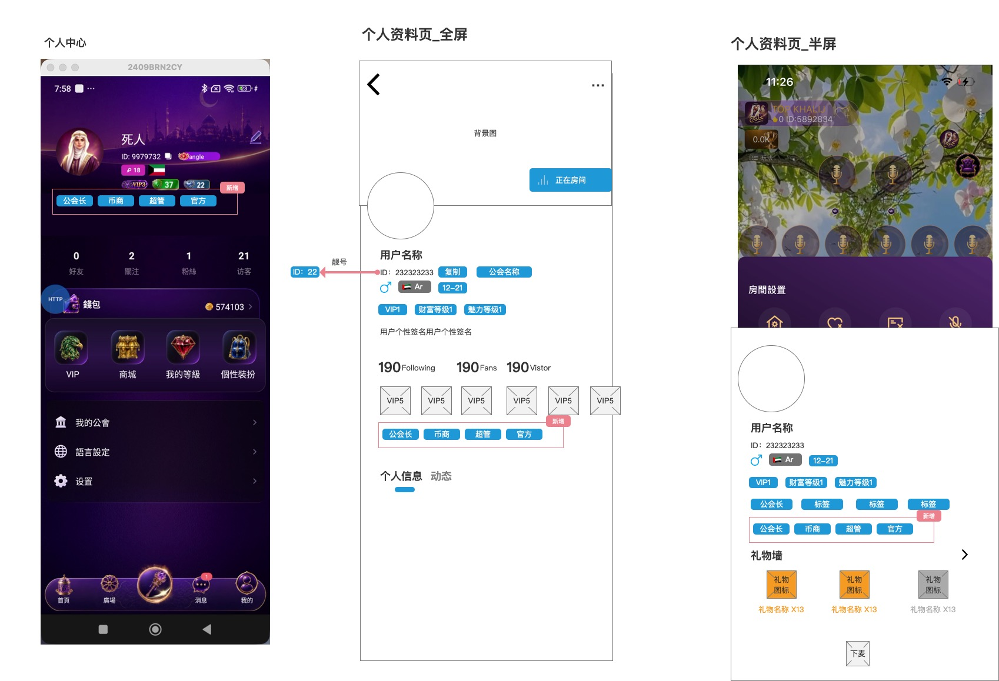

### 3.1.1 页面覆盖范围

| 页面 | 标签位置 |
|---|---|
| 个人中心 | 位于头像、昵称、ID 和等级信息下方，关注/粉丝/访客数据上方。 |
| 个人资料页全屏 | 位于用户资料、等级/权益信息下方，“个人信息/动态”页签上方。 |
| 个人资料页半屏 | 位于半屏资料卡中部、礼物墙上方；底层房间页面继续可见。 |

### 3.1.2 身份标签展示内容

客户端在 §3.1.1 的三个页面中，按用户当前有效身份展示以下标签。标签仅用于展示用户身份，不代表新增按钮、跳转或可操作权限。

| 当前有效身份 | 客户端展示标签 | 展示规则 |
|---|---|---|
| 公会长 | 公会长 | 用户同时具备公会长与主播身份时，只展示“公会长”，不展示“主播”。 |
| 主播 | 主播 | 仅在用户不具备公会长身份且当前具备主播身份时展示。 |
| 币商 | 币商 | 当前具备币商身份时展示。 |
| BD | BD | 当前具备 BD 身份时展示。 |
| official | official | 当前具备 official 身份时展示；不因原型示例使用“官方”而替换脑图已确认的身份值。 |
| BDM | BDM | 当前具备 BDM 身份时展示。 |
| ACM | ACM | 当前具备 ACM 身份时展示。 |
| Manager | Manager | 当前具备 Manager 身份时展示。 |
| Super Admin | Super Admin | 当前具备 Super Admin 身份时展示。 |
| Customer Service / Admin | Customer Service / Admin | 当前具备 Customer Service / Admin 身份时展示。 |

### 3.1.3 当前身份判断与多身份规则

- 展示对象为用户的**当前有效身份**；身份撤销、失效或不再属于当前身份范围后，不再展示对应标签。
- 除“公会长覆盖主播”外，用户同时具备的其他当前有效身份均需展示，不得因原型只展示部分示例标签而漏展示。
- 客户端身份标签与后台用户列表的“用户身份”字段使用相同身份结果；个人中心、个人资料全屏页、个人资料半屏卡的身份集合必须一致。
- VIP、财富等级、魅力等级和其他权益/等级信息继续按原页面分区展示，不能作为身份标签，也不能替代身份标签。
- 脑图和原型未定义多身份的排列优先级、超出一行后的折行/收起方式及单标签视觉样式；客户端不得自行补充业务排序规则。

### 3.1.4 交互与边界

- 本次仅新增身份标签展示，不改变个人资料页、礼物墙、关注、粉丝、访客等既有功能。
- 用户身份变更后的客户端刷新时点与缓存失效时点，源材料未定义；但任一页面刷新后不得继续展示已撤销的身份。
- 历史截图、历史消息不追溯改写。

---

---

## 3.2 首页调整

#### 对应原型

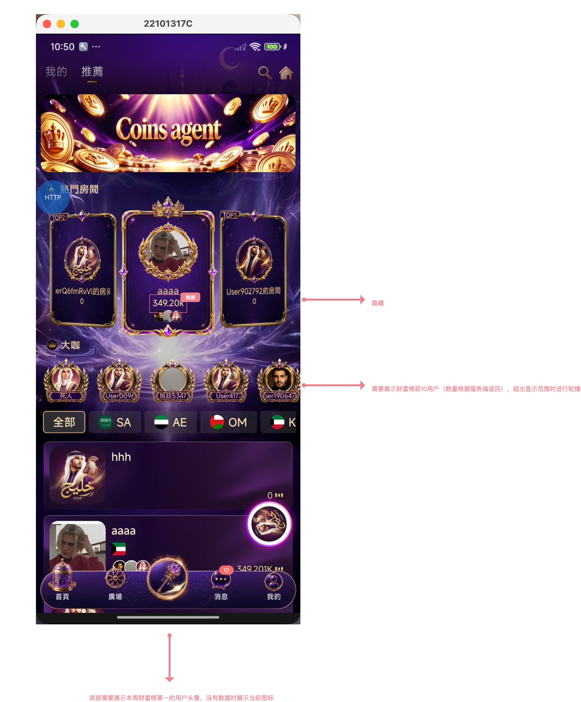

### 3.2.1 热门房间

| 调整项 | 规则 |
|---|---|
| 热度值 | 隐藏热门房间卡片中的热度值。 |
| 其他内容 | 房间封面、房间名称、TOP 标识及既有房间入口保持原页面逻辑；本次不新增原型未展示的排序口径。 |

### 3.2.2 大咖

| 字段/规则 | 说明 |
|---|---|
| 数据范围 | 展示财富榜前 10 位用户，实际返回数量以系统返回为准。 |
| 展示形态 | 以横向头像列表展示用户。 |
| 溢出处理 | 超出当前可见范围时进行轮播展示。 |
| 无数据处理 | 原型未定义空态文案与占位图，待确认。 |

### 3.2.3 榜单入口

| 字段/规则 | 说明 |
|---|---|
| 展示内容 | 页面底部榜单入口展示本周财富榜第一名用户头像。 |
| 无数据 | 无本周财富榜第一名数据时，展示当前入口图标。 |
| 入口行为 | 本次仅调整入口视觉承载内容；点击后的既有跳转逻辑不在本次变更范围。 |

---

---

## 3.3 靓号搜索优化与自动佩戴

#### 对应原型

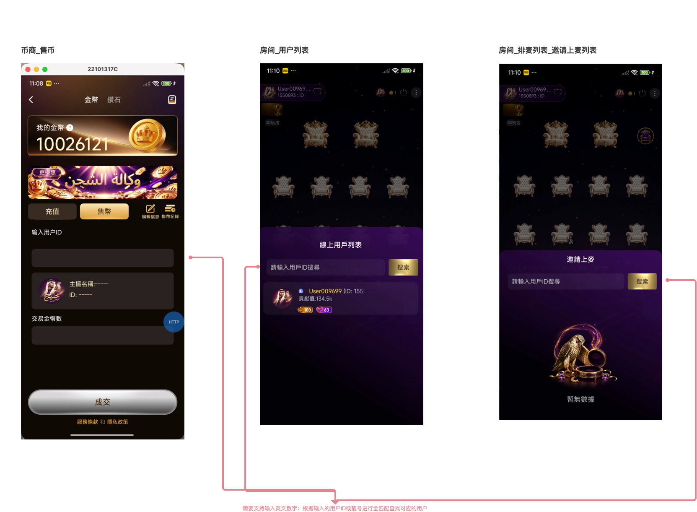

### 3.3.1 覆盖场景

| 场景 | 原型可见入口 | 调整内容 |
|---|---|---|
| 币商售币 | “输入用户ID”输入区，下方展示主播名称与 ID 结果区 | 输入用户 ID 或靓号，全匹配查找对应用户。 |
| 房间用户列表 | “请输入用户ID搜索”输入框与“搜索”按钮 | 输入用户 ID 或靓号，全匹配查找对应用户并展示用户结果。 |
| 排麦列表-邀请上麦列表 | “请输入用户ID搜索”输入框与“搜索”按钮 | 输入用户 ID 或靓号，全匹配查找可邀请用户。 |

### 3.3.2 搜索交互

| 场景 | 成功结果 | 未命中结果 |
|---|---|---|
| 币商售币 | 在用户资料结果区展示命中用户的头像、主播名称和 ID，允许继续填写交易金币数。 | 清空或保持占位结果，不允许将未命中对象带入成交。 |
| 房间用户列表 | 在在线用户列表内展示命中用户资料卡。 | 按原型空态展示“暂无数据”。 |
| 邀请上麦列表 | 在邀请上麦列表内展示命中且可操作的用户。 | 按原型空态展示“暂无数据”。 |

### 3.3.3 自动佩戴靓号

| 触发条件 | 系统处理 |
|---|---|
| 用户获得靓号，且当前未佩戴任何靓号 | 自动佩戴本次发放的靓号。 |
| 用户获得靓号，且当前已佩戴靓号 | 不自动替换当前已佩戴靓号。 |

### 3.3.4 边界

- 搜索仅支持全匹配，不将“输入片段”“相似昵称”作为命中结果。
- 用户 ID 与靓号若可同时命中不同用户，无法安全确认交易/邀请对象；冲突优先级与唯一性规则必须确认后冻结。
- 自动佩戴仅在“获得靓号”事件触发时执行，不应因用户进入搜索页面、查看资料页等行为改变佩戴状态。

---

---

## 3.4 房间管理与房间黑名单

#### 对应原型

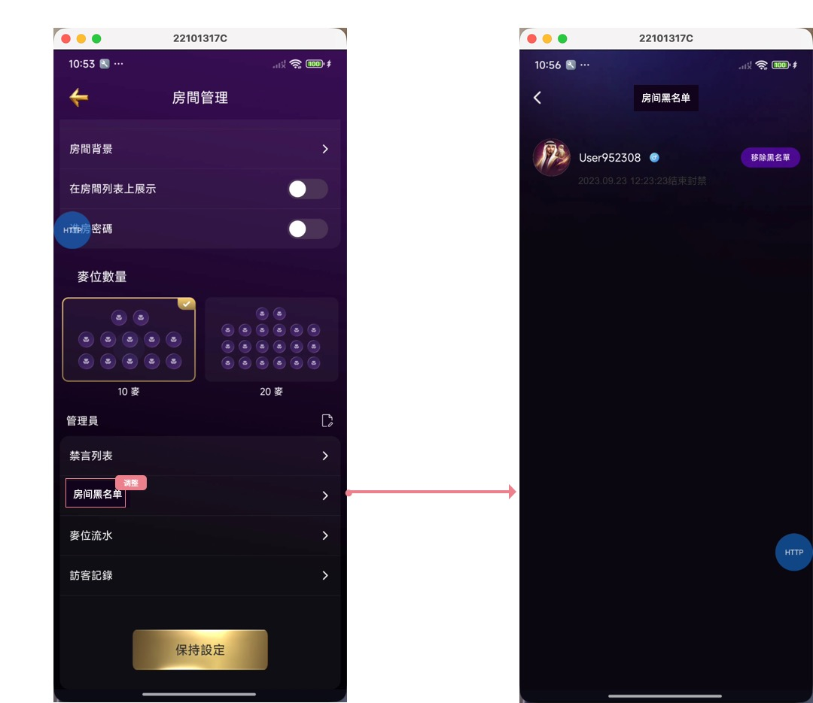

### 3.4.1 页面入口与权限

| 项目 | 说明 |
|---|---|
| 入口 | 房间管理页新增“房间黑名单”列表项；点击进入独立黑名单页面。 |
| 操作角色 | 房主或管理员可手动移出房间黑名单。 |
| 列表操作 | 每条黑名单用户记录提供“移除黑名单”按钮。 |

### 3.4.2 黑名单列表

| 字段/规则 | 说明 |
|---|---|
| 列表对象 | 显示已被该房间踢出、且尚未被移出房间黑名单的用户。 |
| 用户信息 | 显示用户头像、用户名和“移除黑名单”操作。 |
| 排序 | 按踢出时间降序排序，最近被踢出的用户排在最前。 |
| 空列表 | 原型未定义空态文案，待确认。 |

### 3.4.3 踢出与入房拦截

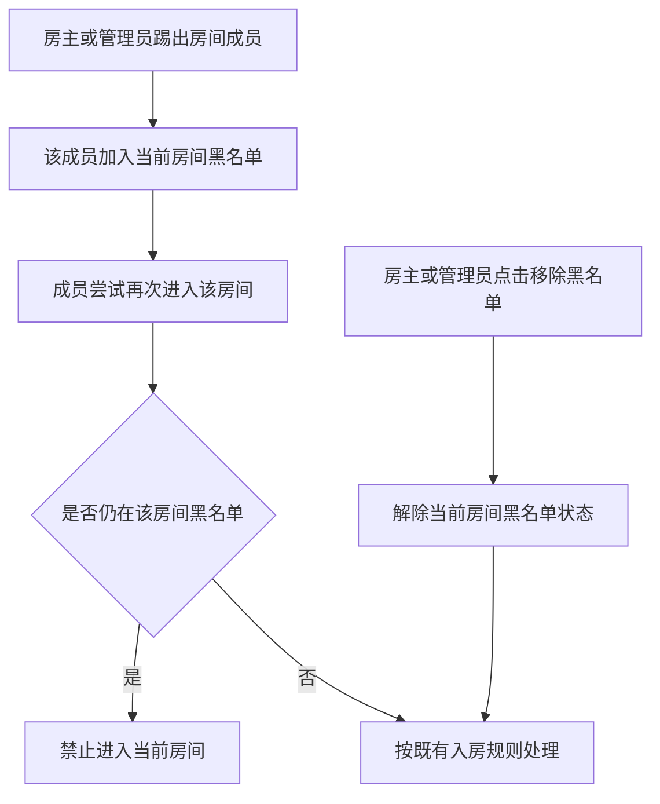

- 用户被踢出某个房间后，必须加入该房间黑名单。
- 在房主或管理员手动移除前，该用户永久无法进入该房间。
- 黑名单按房间维度生效，不延伸为全站黑名单。
- 解除黑名单后，仅解除该房间的入房限制；其他房间状态不受影响。

---

---

## 3.5 房间全服礼物飘屏

#### 对应原型

### 3.5.1 触发条件

后台为礼物配置“全服礼物飘屏”全服广播选项后，用户赠送该礼物时，在所有房间展示该礼物飘屏。

### 3.5.2 飘屏展示结构

| 区块 | 展示内容 | 超长处理 |
|---|---|---|
| 用户信息 | 收礼方、送礼方名称 | 名称超长时跑马展示。 |
| 用户头像 | 收礼方头像 | 按原型位置展示。 |
| 礼物信息 | 礼物名称、礼物图标 | 礼物名称超长时跑马展示。 |
| 文案结构 | “送礼方给收礼方赠送了礼物名称” | 使用当前用户和礼物数据替换原型占位文本。 |

### 3.5.3 队列优先级

| 对比的飘屏类型 | 已确认优先级 | 说明 |
|---|---|---|
| 全服礼物飘屏、幸运礼物飘屏 | 全服礼物飘屏 ＞ 幸运礼物飘屏 | 沿用既有规则。 |
| 游戏中奖全服飘屏、幸运礼物飘屏 | 游戏中奖全服飘屏 ＞ 幸运礼物飘屏 | 本次新增规则。 |
| 全服礼物飘屏、游戏中奖全服飘屏 | 待确认 | 当前规则未定义两者的相对优先级，不得将三类飘屏固化为单一完整优先级链路。 |

- 多条飘屏同时等待展示时，按上述已确认的相对优先级排序；游戏中奖全服飘屏优先于幸运礼物飘屏。
- 同时存在多条游戏中奖全服飘屏时，按各条飘屏的展示时长**升序**展示；展示时长相同的排序规则未定义。
- 展示时长、队列长度、同类消息合并、过期丢弃、断线重连，以及当前正在展示的飘屏是否被更高优先级飘屏打断，当前均未定义。

### 3.5.4 游戏中奖全服飘屏

#### 对应原型

### 3.5.4.1 触发与展示范围

| 规则 | 说明 |
|---|---|
| 触发条件 | 用户在游戏中中奖金币数大于等于阈值 `x` 时，生成游戏中奖全服飘屏。 |
| 展示范围 | 满足触发条件的中奖信息在全服展示。 |
| 非触发情况 | 中奖金币数小于 `x` 时，不生成游戏中奖全服飘屏。 |

### 3.5.4.2 飘屏展示信息

飘屏位于游戏画面顶部、系统状态栏下方，覆盖在游戏场景之上；整体为横向信息条，左侧展示用户信息，右侧展示游戏图标。

| 展示区块 | 展示内容 |
|---|---|
| 用户头像 | 中奖用户头像。 |
| 用户昵称 | 中奖用户昵称。 |
| 中奖文案 | 展示用户在对应游戏中中奖的金币数。 |
| 游戏名称 | 中奖游戏名称。 |
| 游戏图标 | 对应游戏图标。 |

文案信息需表达“用户在游戏名称中获得中奖金币数金币”的中奖事实；原型中的用户名、游戏名和金币数均为占位示例，不作为固定展示值。

### 3.5.4.3 队列规则与边界

- 游戏中奖全服飘屏与幸运礼物飘屏同时等待展示时，游戏中奖全服飘屏优先展示。
- 多条游戏中奖全服飘屏同时等待展示时，按飘屏展示时长从短到长展示。
- 本次仅确认中奖金币数阈值 `x`；阈值具体数值、维护位置、变更生效边界，以及同展示时长的排序兜底规则，见文末待确认项。

---

---

# 四、H5 需求

## 4.1 第三方充值链接兼容靓号

#### 对应原型

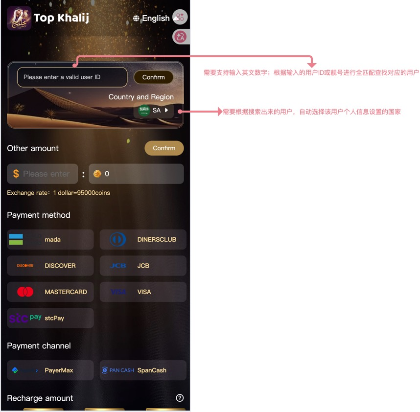

### 4.1.1 页面定位

第三方充值 H5 在“用户 ID”输入与确认区域中，兼容用户 ID 和靓号检索，并按命中用户自动带出其个人资料中的国家地区。

### 4.1.2 页面字段

| 区块 | 原型字段 | 本次规则 |
|---|---|---|
| 用户查询 | `Please enter a valid user ID` 输入框、`Confirm` 按钮 | 支持输入英文数字；根据用户 ID 或靓号全匹配查找对应用户。 |
| 国家地区 | `Country and Region` | 根据命中的用户，自动选择该用户个人资料已设置的国家/地区。 |
| 金额 | `Other amount`、美元输入、金币值、汇率展示 | 本次不改变现有金额和汇率逻辑。 |
| 支付方式 | mada、DINERSCLUB、DISCOVER、JCB、MASTERCARD、VISA、stcPay 等 | 本次不改变现有支付方式范围。 |
| 支付渠道 | PayerMax、SpanCash 等 | 本次不改变现有支付渠道范围。 |

### 4.1.3 查询与国家地区联动

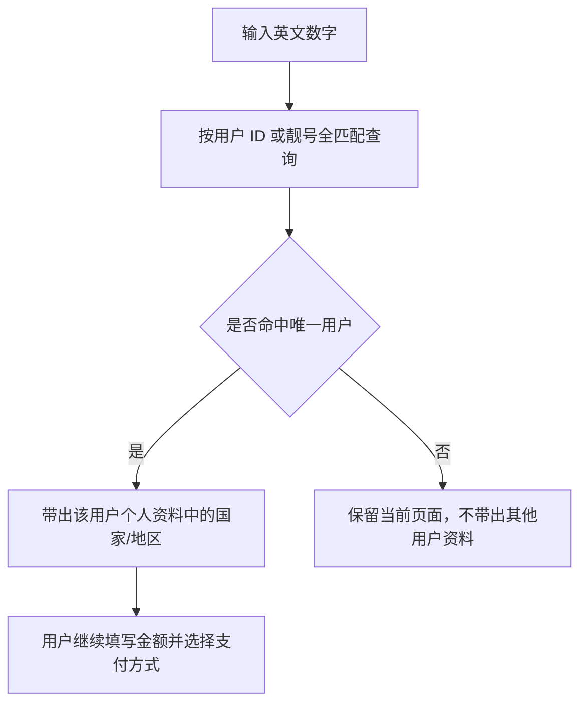

### 4.1.4 异常与边界

- 未命中用户时，不自动变更国家地区，不允许使用其他用户的国家资料继续充值。
- 用户 ID 与靓号命中不同用户时，不应自动选择其中任一用户；冲突规则见待确认项。
- 原型未定义国家地区自动带出后是否允许手动修改；本文档不新增该能力。

---

---

# 五、后台需求

## 5.1 礼物管理：全服礼物飘屏配置

#### 对应原型

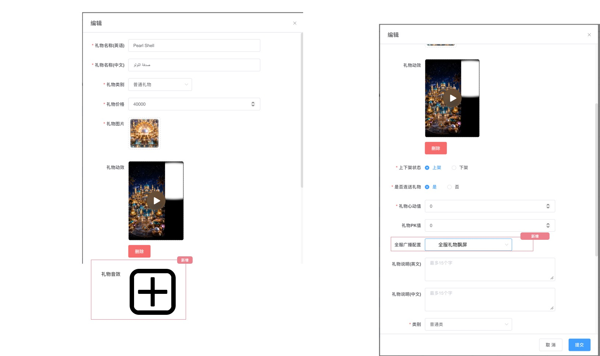

### 5.1.1 全服广播配置

| 配置项 | 规则 |
|---|---|
| 全服礼物飘屏 | 为礼物配置该选项后，赠送该礼物时，所有房间都可收到该礼物的广播信息并展示全服礼物飘屏。 |
| 未配置该选项 | 不触发本版本新增的全服礼物飘屏。 |

- 配置项与客户端 3.8 的飘屏展示对应。
- 原型未展开全服广播配置的其他选项；本版本仅新增“全服礼物飘屏”，不改写未展示的既有选项。

---

---

## 5.2 用户账号管理：用户身份

#### 对应原型

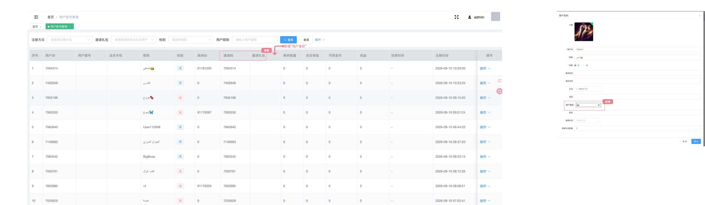

### 5.2.1 用户列表调整

| 调整项 | 规则 |
|---|---|
| 隐藏字段 | 隐藏“邀请码”“邀请礼包”两列。 |
| 新增字段 | 在列表中新增“用户身份”，展示用户当前身份。 |
| 身份展示范围 | 展示公会长、主播、币商、BD、official、BDM、ACM、Manager、Super Admin、Customer Service / Admin 等当前身份。 |
| 公会长/主播展示 | 同时具备公会长与主播身份时仅展示公会长；仅具主播身份时展示主播。 |
| 前后台一致性 | 后台列表与客户端 §3.1 使用相同的当前身份结果；展示字段不能只保留原型示例中的部分身份。 |

### 5.2.2 用户资料调整

| 字段 | 控件 | 可编辑范围 |
|---|---|---|
| 用户身份 | 下拉选择（支持多选） | 可编辑 BD、official、BDM、ACM、Manager、Super Admin、Customer Service / Admin。 |

### 5.2.3 保存与同步

- 用户资料侧栏新增“用户身份”字段，原型展示为下拉选择，示例值为 `BD`。
- 脑图明确该字段**支持多选**；用户可同时保留多项可编辑的当前身份。
- 点击“确定”后，用户身份结果同步至后台用户列表与客户端资料标签。
- 取消或关闭侧栏时，不改变已保存身份。
- 公会长、主播、币商的来源与是否允许在此字段直接编辑，脑图未列入可编辑范围；本次不将其擅自加入后台下拉选项。

### 5.2.4 权限边界

- 编辑 BD、BDM、Manager、Super Admin、Customer Service / Admin 等身份会直接影响后台权限与用户端身份展示。
- 谁可编辑哪些身份、是否支持多身份并存、身份变更后是否即时生效，源材料未给出，属于上线前必须确认的高优先级规则。

---

---

# 六、核心状态与流程

## 6.1 房间黑名单状态

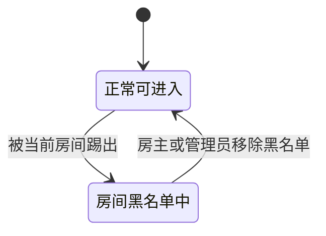

## 6.2 全服礼物飘屏链路

## 6.3 游戏中奖全服飘屏链路

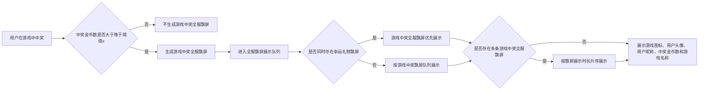

---

---

# 七、源材料覆盖核对

| 脑图/原型模块 | PRD章节 | 原型文件 | 覆盖结论 |
|---|---|---|---|
| 身份标签：个人中心/全屏/半屏 | 2.1、3.1、5.2 | 身份标签.jpg、用户管理.jpg | 已覆盖；后台身份字段支持多选 |
| 首页热门房间/大咖/榜单入口 | 3.2 | 首页调整.jpg | 已覆盖 |
| 靓号搜索与自动佩戴 | 2.2、3.3 | 靓号搜索优化.jpg | 已覆盖 |
| 房间黑名单、踢出后禁入、按踢出时间降序 | 3.4、6.1 | 房间管理-房间黑名单.jpg | 已覆盖 |
| 房间全服礼物飘屏与游戏中奖全服飘屏 | 3.5、5.1、6.2、6.3 | 房间全服礼物飘屏.jpg、游戏中奖全服飘屏.jpg、礼物管理.jpg | 已覆盖：游戏中奖阈值触发、全服展示字段、与幸运礼物的优先级及同类按展示时长升序规则已补齐。 |
| H5：第三方充值兼容靓号、自动带国家 | 4.1 | 第三方充值链接兼容靓号.jpg | 已覆盖 |

---

# 八、待产品确认项

| 编号 | 模块 | 待确认内容 | 影响 |
|---:|---|---|---|
| 1 | 用户身份 | 多身份标签排序、超出一行后的折行/收起方式、标签视觉样式，以及身份变更后的客户端刷新/缓存失效时点。 | 客户端展示一致性。 |
| 2 | 用户身份 | 哪类后台操作者可编辑哪些身份；Super Admin 等高权限身份是否需二次审核；身份变更何时生效。 | 权限安全与前后台一致性。 |
| 3 | 靓号搜索/H5 | 用户 ID 与靓号可能命中不同用户时的唯一性与拦截规则。 | 售币、邀请、充值对象准确性。 |
| 4 | 全服礼物飘屏 | 展示时长、队列长度、重复礼物合并、超时丢弃及断线重连处理。 | 高并发房间展示一致性。 |
| 5 | 房间黑名单 | 重复踢出同一用户时是否更新踢出时间；黑名单列表空态及入房拦截提示文案。 | 列表排序与用户提示。 |
| 6 | 游戏中奖全服飘屏 | 阈值 `x` 的具体数值、维护位置及变更生效边界；全服礼物飘屏与游戏中奖全服飘屏的相对优先级；同展示时长的排序兜底规则。 | 触发口径与跨类型队列排序一致性。 |
| 7 | 游戏中奖全服飘屏 | 展示时长、队列长度、同类消息合并、过期丢弃、断线重连，以及当前正在展示的飘屏是否可被更高优先级飘屏打断。 | 高并发场景下的展示一致性。 |
